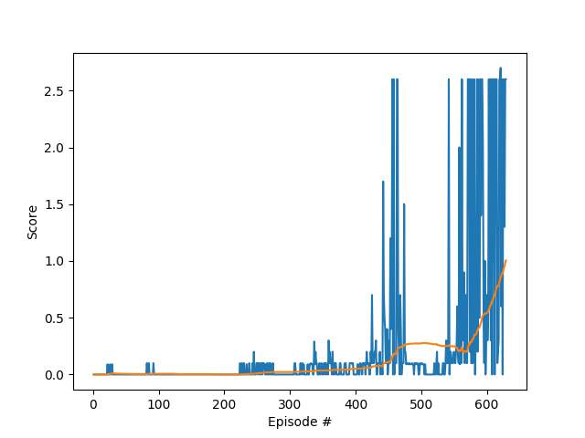

# Solving Tennis Environment with Multi-Agent Deep Deterministic Policy Gradients

## Overview

This report describes my solution to the Tennis environment as part of 
the Collaboration and Competition project from Udacity Deep Reinforcement Learning Nanodegree. 

My solution implements an adaptation of Multi-Agent Deep Deterministic Policy Gradients (MADDPG) algorithm as proposed by
Lowe, Ryan, et al. "Multi-agent actor-critic for mixed cooperative-competitive environments." for the collaborative self-play agent.

The implementation is done in Python using PyTorch. 

## Learning Algorithm

The learning algorithm for the Tennis environment is implemented in [tennis.py](tennis.py). 
The algorithm is similar to MADDPG an actor (`Actor` class) and a critic (`Critic` class) models.
The main difference from MADDPG is that agents share actor and critic models. 
The actor model learns to predict an action vector given the state of the environment as observed by the agent.
The critic model learns Q-values for combined states and actions from all the agents in the environment.
In this way, the actor only relies on local information while the critic uses global information.

The experience replay (`Replay` class) is used to sample batches of uncorrelated experiences to train on. 
It also uses target models for both actor and critic, similar to fixed Q-targets and double DQN technique.
Online models are updated by minimizing loses while target models are updated through soft update, 
i.e. online model parameters values are partially transferred to target models. 
This helps to avoid overestimation of Q-values and makes the training more stable.

The learning algorithm is implemented in the `SelfPlayAgent` class. 
Since all agents use the same actor and critic model, 
the agent computes actions and learns for agents on both sides.
The `act` method accepts local states and returns actions for all agents.
Noise is added to the actions to allow exploration of the the action space.
The noise is generated through the Ornstein–Uhlenbeck process, one per agent, 
which is a stochastic process that is both Gaussian and Markov, drifting towards the mean in long-term.

The `learn` method updates actor and critic model based on experiences (transitions) from all agents at the same time:

1. A batch of transitions is sampled from the replay buffer.
2. Update online critic model
    1. Compute actions for the next states with the target actor model
    2. Compute Q-values for the next states and actions with the target critic model
    3. Compute target Q-values for the current states and actions using the Bellman equation
    4. Compute Q-values for the current states and actions with the online critic model
    5. Use the target and online Q-values to compute the loss
    6. Minimize the loss for the online critic model
3. Update online actor model
    1. Compute actions for current states with the online actor model
    2. Compute Q-values with the online critic model
    3. Use the Q-values to compute the loss
    4. Minimize the loss for the online actor model
4. Soft update of the target critic and actor models

Training of the agent is implemented in the `run` function, which has the following flow:

1. Every timestep, the environment provides states as observed by each agent
2. The agent computes actions for these states.
3. Given the actions, the environment provides next states, rewards and whether the episode is completed for each agent.
4. States, actions, next states and the rewards constitute the transition that is added to replay buffer.
5. When enough experiences are collected the agent learns as described above.

One distinguishing feature of my implementation is that when computing Q-values with Bellman equation, 
the rewards of all agents are added together. 
It makes sense in the collaborative environment when both agents should perform well to achieve high scores.
 
## Network architecture

The agent uses two network architectures, one for actor and one for critic.
The actor network maps state to action and has the following structure:
 
1. State input (24 units)
2. Hidden layer (128 units) with ReLU activation and batch normalization
3. Hidden layer (128 units) with ReLU activation and batch normalization
4. Action output (2 units) with tanh activation

The critic network maps combined states and actions of both agents to Q value and has the following structure:

1. Input for local states of both agents (24 * 2 = 48 units)
2. Hidden layer (128 nodes) with ReLU activation and batch normalization
3. Input for actions of both agents (2 * 2 = 4 units)
4. Hidden layer with inputs from layers 2 and 3 (128 nodes) with ReLU activation and batch normalization
5. Q-value output (1 node)

## Hyperparameters

| Hyperparameter | Value | Description |
|---|---:|---|
| Replay buffer size | 1e6 | Maximum size of experience replay buffer |
| Replay batch size | 128 | Number of experiences sampled in one batch |
| Actor hidden units | 128, 128 | Number of units in hidden layers of the actor model |
| Actor critic units | 128, 128 | Number of units in hidden layers of the critic model |
| Actor learning rate | 1e-3 | Controls parameters update of the online actor model |
| Critic learning rate | 2e-3 | Controls parameters update of the online critic model |
| Target update mix | 3e-3 | Controls parameters update of the target actor and critic models |
| Discount factor | 0.99 | Discount rate for future rewards |
| Ornstein-Uhlenbeck, mu | 0 | Mean of the stochastic  process|
| Ornstein-Uhlenbeck, theta | 0.15 | Parameter of the stochastic process |
| Ornstein-Uhlenbeck, sigma | 0.1 | Standard deviation of the stochastic process |
| Max episodes | 1000 | Maximum number of episodes to train |
| Max steps | 1e6 | Maximum number of timesteps per episode |

## Results

The agent was able to achieve an average score of +0.5 over consecutive 100 episodes after 592 
episodes and +1.0 after 628 episodes. Plot of the scores:

## Future work

1. Better control of the exploration-exploitation trade-off by implementing a decreasing schedule for the sigma parameter of the
Ornstein-Uhlenbeck process.
2. An actor model that learns actions for both agents at the same time, 
e.g. input are observations and output are actions of both agents.

